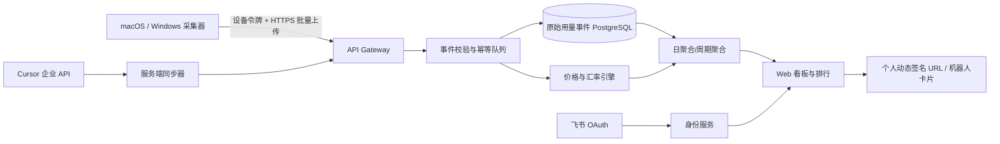

# Token 潮汐（Token Tide）产品与技术设计

> 版本：v0.2  
> 日期：2026-06-20  
> 状态：待评审  
> 产品定位：公司内部大模型用量展示、成本量化与趣味化排行平台

## 1. 一句话定义

员工在 Windows 或 macOS 安装轻量采集器，经飞书登录绑定身份后，可从 Codex CLI、Claude Code CLI、Cursor、Trae 等工具采集实际调用的大模型与 Token 用量；网页按日、周、月、年或自定义周期展示总排名、模型占比、工具标签、估算成本、趋势和海洋动物等级，并生成可用于飞书的动态签名。

产品的主语是“模型使用”，不是“工具使用”：Codex、Claude Code、Cursor、Trae 是 `tool`（调用入口），GLM、DeepSeek、Claude Opus、GPT 等是 `model`（计量与定价对象），模型供应商是 `provider`。同一个工具可以调用多个模型，同一个模型也可能从多个工具调用。

产品名确定为 **Token 潮汐（Token Tide）**，口号是“看看今天谁在深蓝里掀起浪花”。模型用量形成潮汐，不同工具是探索装备，累计成长等级由海洋动物表示。命名贴合海洋科技公司，同时避免把“消耗越多”包装成工作绩效。

## 2. 目标与非目标

### 2.1 产品目标

1. 让个人知道自己通过哪些工具调用了哪些模型，各用了多少 Token、折合多少钱。
2. 让团队看到采用率、趋势和成本结构，不读取提示词、代码或对话正文。
3. 用排名、海洋动物成长、可爱徽章和签名增加参与感，但不把用量等同于绩效。
4. 同一套协议支持 macOS、Windows，并允许后续扩展更多工具。
5. 对“精确账单”“本地解析”“估算值”做清晰标识，避免伪精确。
6. 新增一个符合统一事件协议的工具适配器，目标开发量不超过 2 人日，尽可能扩大模型与工具覆盖面。

### 2.2 首期不做

- 不采集代码、文件名、仓库地址、提示词或模型输出正文。
- 不把 Token 排名用于员工绩效评价。
- 不绕过工具权限、破解加密数据库或抓取私有网络请求。
- 不承诺所有订阅制工具都能还原真实供应商成本。
- 不在 MVP 实现移动端原生应用、跨公司多租户计费或财务报销。

## 3. 核心用户与权限

| 角色 | 能力 |
|---|---|
| 普通员工 | 飞书登录、绑定采集器、上传、看个人明细/排行榜、改展示名与匿名状态、配置签名 |
| 团队负责人 | 查看本部门聚合趋势；默认不能查看个人对话或本地路径 |
| 平台管理员 | 管理组织、价格表、汇率、数据源健康、异常数据、可见性规则 |
| 审计员 | 查看管理操作和数据修订日志，不直接修改业务数据 |

权限采用组织 `tenant_id` + 角色 RBAC + 部门范围 ABAC。所有查询必须带租户隔离条件。

## 4. 关键用户流程

### 4.1 首次使用

1. 用户访问网页，选择“飞书登录”。
2. OAuth 回调后创建组织内账号，读取最小必要身份：`open_id/user_id`、姓名、头像、邮箱、部门（按授权范围）。
3. 用户选择公开名称、昵称或匿名。匿名默认展示稳定化名，例如“匿名水獭 042”，不同统计周期不变。
4. 网页自动推荐操作系统，并提供“下载安装包”和“复制一行命令”两个并列入口；用户也可手动切换 macOS、Windows、Linux。
5. 安装命令只负责下载已签名采集器并启动浏览器设备授权，不把长期令牌拼在命令或 URL 中。
6. 用户在网页确认设备，采集器执行一次本地扫描，只上传字段白名单内的聚合用量。
7. 网页通过 SSE/WebSocket 实时显示：`等待安装 → 已配对 → 扫描中 → 已收到 N 条 → 排行榜已更新`，并展示本次收到的工具、模型、Token、时间范围与计价覆盖率。

### 4.1.1 分操作系统接入页

网页路由建议为 `/connect`，顶部用 macOS、Windows、Linux 三个标签页。示例命令仅在正式域名和代码签名准备好后发布：

```bash
# macOS / Linux：一行安装并启动首次同步
curl -fsSL https://token.example.com/install.sh | sh
```

```powershell
# Windows PowerShell：一行安装并启动首次同步
irm https://token.example.com/install.ps1 | iex
```

每个页面同时提供更容易审计的替代方式：查看安装脚本、复制校验命令、下载 SHA-256、下载签名的 `.pkg/.dmg` 或 `.msi/.exe`。默认安装在用户目录，不要求管理员权限；只有用户主动启用全机扫描或自动启动时才单独说明权限用途。

首次同步完成后，网页呈现绿色确认卡：

```text
✓ 已收到刘通的首次上传
工具：Codex CLI、Claude Code
模型：4 个｜事件：126 条｜Token：1.84M
时间范围：06-01 至 06-20｜可计价覆盖率：93.2%
```

如果没有收到数据，页面按状态给具体修复动作，而不是只显示“失败”：未运行命令、设备未授权、没有发现日志、日志无 usage 字段、网络上传失败、模型尚未映射分别处理。

### 4.2 日常同步

- 默认模式是一次性命令或“一键同步”，采集完成即退出，不常驻、不注入工具进程。
- CLI 支持 `token-tide scan --preview`、`token-tide sync`、`token-tide doctor`；用户无需打开桌面 UI。
- 首次上传成功后展示一次非阻断提示：“建议开启定时采集，排行榜和飞书签名会保持更新”。用户可选每 6 小时、每天一次或仅手动。
- 定时采集必须由用户主动开启，默认关闭；提示支持“暂不开启”和“不再提醒”，之后可在设备设置随时启停或修改频率。
- 开启前明确说明：会创建哪个用户级计划任务、读取哪些目录、何时联网以及如何卸载。定时任务只唤醒一次性 CLI，采集结束即退出，不安装持续监听工具进程的注入组件。
- 可选轻量托盘 UI 展示最近同步时间、各来源状态、待上传事件数；不是必装组件。
- 上传失败时指数退避；离线事件保留 30 天；同一事件重复上传不重复计数。

### 4.3 排行与签名

1. 用户选择统计周期：今日、本周、本月、本年、自定义。
2. 看总 Token、总价、模型构成、工具来源、趋势和名次变化。
3. 选择签名模板与统计周期，系统生成个人稳定签名 URL。
4. 用户只需首次把 URL 粘贴进飞书签名；URL 对应页面的标题、Open Graph 摘要和详情页会随最新统计动态更新。

## 5. 页面信息架构与趣味设计

### 5.1 首页“竞技场”

- 顶部：周期切换、部门筛选、更新时间、数据完整度。
- Hero：全公司本周期 Token、估算成本、活跃人数、同比/环比。
- 排行榜：名次、头像/匿名头像、名称、海洋动物徽章、工具标签、Token、总价、趋势箭头、数据精度。
- 每个人名次下方显示一条 100% 堆叠模型占比条；颜色固定映射到规范模型，悬停展示模型名、Token、占比和费用。
- “模型生态缸”：用气泡大小表示模型 Token，占比而非生产力。
- “今日播报”：首次突破、连续活跃、成本下降、缓存命中等正向事件。

动效应轻量：海面波纹、气泡、前三名柔和荧光、动物升级动画和数字滚动；支持“减少动态效果”。视觉建议深海蓝、青绿生物荧光与珊瑚橙点缀，但表格和数字必须保持高可读性。

### 5.2 个人页

- Token、输入/输出/缓存读写拆分。
- 真实账单成本、API 等价估算、订阅分摊三者分开展示。
- 工具、模型、日期趋势与数据精度。
- 同期排名、动物成长进度、升级历史与历史最佳。
- 隐私开关、展示名、签名、设备和同步状态。

### 5.3 排行榜单行设计

```text
#01  刘通  [🐬 海豚]   工具：Codex CLI · Claude Code   8.42M Token   ≈¥214.60  ↑2
     GPT 系列 46%  █████████░░  Claude 31%  ██████░░  GLM 15%  ███░  其他 8%
```

- 工具标签来自该统计周期真实产生事件的 `tool`，按 Token 降序，最多显示 3 个，更多折叠为 `+N`。
- 模型占比条按 `model_id` 聚合，最多单列前 5 个，其余归为“其他”；不能把不同别名误拆成多个颜色段。
- 占比默认按 Token 计算；切换成本榜时仍保持 Token 占比，悬停同时显示该模型成本，避免两个口径在同一条中混淆。
- 移动端主行只保留名次、名称、Token、总价；工具与模型占比下移一行。

### 5.4 管理页

- 数据源版本与解析成功率。
- 价格版本、汇率版本、生效时间。
- 异常事件、重复率、迟到数据、客户端版本分布。
- 用户/部门可见性与数据保留策略。

## 6. 排名与海洋动物成长设计

### 6.1 排名口径

默认排行榜以周期内 `total_tokens` 降序；成本作为第二维度，不混为一个分数。支持切换：

- Token 榜：输入 + 输出 + 缓存读 + 缓存写，保留分项。
- 成本榜：以事件发生时适用的价格版本和汇率版本计算。
- 增长榜：与上一个等长周期比较。
- 效率徽章：缓存命中率、活跃天数、单位成本 Token 等，不产生主排名。

不同模型和供应商的 Tokenizer/缓存口径并不完全一致，页面必须展示“可比性提示”。未知模型或仅有请求次数时，不得虚构 Token。总排名跨工具汇总，但以规范 `model_id` 去重，避免同一次请求被 CLI 日志和供应商账单重复计算。

### 6.2 海洋动物成长等级

动物等级按账号累计“潮汐值”升级，只升不降；日、周、月排行榜名次仍按所选周期 Token 独立计算。这样用户可以长期养成自己的海洋伙伴，不会因为某周休假突然掉级。

```text
潮汐值 = input_tokens + output_tokens + cache_write_tokens + cache_read_tokens × 0.1
```

缓存读取权重较低，避免仅靠大量缓存命中快速升级；公式与阈值由管理员版本化配置，历史升级记录不因调参回退。首版建议阈值：

| 等级 | 累计潮汐值 | 动物徽章 | 成长文案 |
|---:|---:|---|---|
| Lv.1 | 0 | ⭐ 小海星 | 在浅滩点亮第一颗星 |
| Lv.2 | 200K | 🐚 小海马 | 跟着洋流开始探索 |
| Lv.3 | 1M | 🪼 水母 | 上下文开始发光 |
| Lv.4 | 3M | 🐠 小丑鱼 | 穿梭在模型珊瑚礁 |
| Lv.5 | 10M | 🐢 海龟 | 稳定航行，持续积累 |
| Lv.6 | 30M | 🐬 海豚 | 灵活调用多种模型 |
| Lv.7 | 80M | 🐙 章鱼 | 多工具协同高手 |
| Lv.8 | 200M | 🦈 鲨鱼 | 深海高活跃探索者 |
| Lv.9 | 500M | 🐋 虎鲸 | 驾驭复杂上下文 |
| Lv.10 | 1B | 🐳 蓝鲸 | 深蓝中的 Token 巨鲸 |

上线首月只记录潮汐值，不锁死阈值；根据公司真实分布校准一次后冻结首赛季。升级时显示新动物、累计潮汐值、距下一级进度和升级日期。动物等级只表示 AI 工具累计活跃度，页面固定提示“不是能力、产出或绩效评价”。

### 6.3 可爱动物徽章规范

- 风格：圆润、友好、轻拟物扁平插画；大眼但不过度幼儿化，统一深海蓝描边和珊瑚色高光。
- 每个动物保留一个强识别轮廓，小尺寸下不依赖文字；避免真实捕食或攻击画面。
- 每级输出 SVG 源文件，以及透明背景 PNG：`32×32`、`64×64`、`128×128`、`256×256`。
- 排行榜使用 32/64 px，个人页使用 128 px，升级弹窗和飞书 OG 图使用 256 px。
- 每枚徽章提供中文等级名、无障碍 alt 文本、主色、暗色背景安全色和单色降级版。
- Emoji 只作为飞书纯文本降级；正式徽章使用自有插画，避免不同系统 Emoji 风格不一致。

### 6.4 防刷与异常

- 单事件、单日、模型维度设置软异常阈值，只标记不自动删除。
- 客户端事件带稳定 `source_event_id`；服务端以租户、用户、来源、事件 ID 幂等。
- 对时间回拨、未来时间、异常模型名、负数和极端 Token 做隔离。
- 管理员修订必须保留原值、原因、操作者和时间。

## 7. 周期定义

- 日：组织时区 00:00–24:00，默认 `Asia/Shanghai`。
- 周：周一 00:00 至下周一 00:00。
- 月/年：自然月/自然年。
- 自定义：闭开区间 `[start, end)`，最大 366 天。
- 事件统一存 UTC，展示和聚合按组织时区。
- 迟到数据到达后重算受影响的日聚合，并更新上层周期。

签名周期建议只开放“今日、本周、本月”三种，既短又容易理解；网页分析保留全部周期。

## 8. 成本换算

### 8.1 成本类型与自动判定

1. `billed_cost`：来源提供的真实账单金额，可信度最高。
2. `api_equivalent_cost`：按模型输入/输出/缓存 Token 与公开单价估算。
3. `subscription_cost`：个人订阅按账单周期折算；公司统一订阅可按席位分摊，只用于预算视角。

页面默认显示真实账单；没有真实账单时显示“API 等价估算”，并带 `≈`。订阅工具的实际边际成本可能为 0，不能把估算值标成公司已支付金额。

考虑公司大部分用户使用个人订阅，首次识别某个工具时允许用户确认账号类型：`个人订阅`（默认推荐）、`API 按量付费`、`公司统一账号`、`不确定`。如果本地日志或官方 API 能可靠识别则自动填入，不能识别时不擅自判断。

每个工具按以下优先级自动选择成本展示：

1. 来源事件或账单 API 带有明确金额：计入“真实账单总额”。
2. 用户配置个人订阅名称、月费、币种和结算日：按当前统计周期折算“订阅支出”，不按 Token 重复收费。
3. 能识别精确模型并存在公开单价：计算“API 等价总价”，统一加 `≈`。
4. 只能识别 Token、不能识别价格：Token 计入总榜，费用显示“待定”，绝不能按 0 元处理。

默认总览卡优先显示用户最容易理解的两个数字：

```text
本期已知支出：¥128.00（个人订阅折算）
API 等价总价：≈¥436.70（已覆盖 92% Token）
```

如果用户不填写订阅费或账号类型无法判断，则只显示按各模型价格相加后的“API 等价总价”。排行榜成本榜默认使用 API 等价总价，保证不同个人订阅之间口径一致；真实账单/订阅支出仅作为个人和管理员预算视角，不参与默认成本排名。

### 8.2 计算公式

```text
USD = input_tokens / 1e6 * input_price
    + output_tokens / 1e6 * output_price
    + cache_read_tokens / 1e6 * cache_read_price
    + cache_write_tokens / 1e6 * cache_write_price

CNY = USD * fx_rate_at_event_date
```

每个人的总价为各模型明细费用之和，而不是用一个平均价乘总 Token：

```text
user_total_cost(period) = Σ cost(event_model, token_type, event_time, pricing_context)
```

价格表必须版本化：`provider + canonical_model_id + pricing_context + region + effective_from + effective_to`。`pricing_context` 用来区分官方 API、云平台代理、批处理、订阅等不同价目。历史事件默认使用事件发生日与实际渠道价格；管理员可触发“按最新价格模拟”，但不能覆盖原始结果。未知模型进入待映射队列，成本显示“部分未知”，且总价展示已覆盖成本比例。

### 8.3 模型注册表与别名归一化

模型不可硬编码为固定枚举。服务端维护版本化模型注册表：

- `provider`：模型供应商，例如 OpenAI、Anthropic、智谱、DeepSeek。
- `canonical_model_id`：内部稳定 ID，不跟展示名称变化。
- `display_name`：页面展示名。
- `observed_alias`：工具日志里的原始名称，例如缩写、渠道前缀或版本后缀。
- `family` 与 `version`：支持按系列聚合，同时保留精确版本定价。
- `pricing_context`：实际调用渠道；同名模型在不同渠道可能价格不同。

用户提到的 `GLM`、`dpV4`、`ops4.8`、`gpt5.5` 先作为“观测别名示例”进入注册表 PoC，不在未核实前擅自改写为某个正式模型名。匹配顺序为精确别名 → 受控正则 → 人工审核；未知别名保留原文、Token 可计入总榜，但费用暂不计算。

## 9. 数据采集可行性与策略

每个适配器输出统一事件，不直接上传源文件。精度等级：

- A：官方 API/账单返回的 Token 或金额。
- B：本地结构化日志中明确的 Token 字段。
- C：根据可见文本或请求统计估算。
- D：仅请求次数/活跃度，不能进入 Token 主榜。

| 来源 | 首选方式 | 预计精度 | MVP 决策 |
|---|---|---:|---|
| Codex CLI/桌面端 | 读取本地会话日志中的工具、实际模型、用量字段；API Key 场景可对账平台用量 | B/A | PoC 后纳入 MVP |
| Claude Code CLI/桌面端 | 读取本地结构化日志中的工具、实际模型与 usage 字段；API/组织账单用于对账 | B/A | PoC 后纳入 MVP |
| Cursor 企业版 | 服务端接 Cursor Admin/Analytics API，按用户和日期拉取 | A/B | 企业客户优先方案 |
| Cursor 个人/普通团队 | 仅解析明确且稳定的本地结构化用量；禁止抓包或推断私有协议 | B–D | PoC 决定是否进 Token 榜 |
| Trae | 优先官方导出/API；否则只解析明确本地 usage 字段 | B–D | 先做实验适配器，不承诺精确 Token |

Cursor 官方 Analytics API 当前明确为企业团队能力，支持管理员作用域、用户筛选和日期范围；其日期窗口存在限制，服务端同步任务应分片并缓存。参考：[Cursor Analytics API](https://cursor.com/docs/account/teams/analytics-api)。

适配器必须优先读取日志里实际返回的模型标识，不能根据工具名推断模型。还必须具备：版本探测、只读访问、增量游标、字段白名单、最大文件尺寸、解析器版本、样本夹具和失败降级。源文件结构变化时只停用对应适配器，不影响其他来源。

### 9.1 “尽量多支持”的扩展策略

不把所有工具写进一个巨大扫描器，而是提供稳定的 Collector Adapter SDK。每个适配器只负责 `Detect → Preview → Collect → Normalize`，统一输出事件协议。新增工具不需要修改排行、计价或网页代码。

适配器候选按价值分批推进：

| 层级 | 工具/来源示例 | 采集策略 |
|---|---|---|
| P0 CLI | Codex CLI、Claude Code、Gemini CLI、OpenCode、Aider | 本地结构化会话/usage 日志，优先明确 Token 字段 |
| P0 代理/网关 | LiteLLM、OpenRouter、公司模型网关、供应商 API 账单 | 官方 API 或标准 usage 响应，通常精度最高 |
| P1 编辑器 | Cursor、Trae、Windsurf、Cline、Roo Code、Continue | 官方导出/API优先，本地稳定结构化字段次之 |
| P1 本地模型 | Ollama、LM Studio、vLLM | 本地服务统计或请求 usage；成本可为电力/设备分摊或 0，不套云 API 价 |
| P2 IDE/其他 | JetBrains AI、Zed、VS Code 其他 AI 扩展 | 按用户需求和可验证数据精度逐个适配 |

上表是适配优先级清单，不代表这些工具当前都保证能读取精确 Token。每个适配器必须在兼容矩阵中公开支持的操作系统、工具版本、可读字段、精度等级和最近验证日期。

### 9.2 适配器发现与发布

- 客户端内置稳定适配器，并可从公司签名的适配器索引下载增量更新。
- 适配器声明 `tool_id`、支持路径、版本范围、所需权限、禁止字段测试和解析器哈希。
- 社区适配器先进入隔离测试，不允许自行联网或执行任意命令；通过安全审核后才能进入官方索引。
- 未安装对应工具时静默跳过，不弹错误；发现新工具时只提示一次“可新增采集来源”。
- 服务端远程配置可以熔断单个适配器版本，避免上游日志改版造成错误排名。

## 10. 统一事件协议

```json
{
  "schema_version": 1,
  "source_event_id": "sha256:...",
  "provider": "anthropic",
  "tool": "claude_code",
  "observed_model": "provider-route/ops4.8",
  "canonical_model_id": null,
  "pricing_context": "provider_api",
  "occurred_at": "2026-06-20T08:15:00Z",
  "input_tokens": 1200,
  "output_tokens": 340,
  "cache_read_tokens": 800,
  "cache_write_tokens": 0,
  "request_count": 1,
  "cost": null,
  "currency": null,
  "precision": "B",
  "parser_version": "claude-code/1.2.0"
}
```

禁止字段：prompt、completion、代码、文件路径、项目名、仓库 URL、命令正文、API Key、会话令牌。

## 11. 系统架构



### 11.1 推荐技术栈

- Web：Next.js + TypeScript + Tailwind CSS + ECharts。
- API：Go（与采集器共享类型更容易）或 NestJS；建议 Go 以降低部署和跨平台心智负担。
- 采集器核心：单文件 Go CLI，优先提供无界面、一次性运行方式；产出 macOS、Windows、Linux 二进制。
- 可选桌面壳：Wails，仅提供托盘、预览和定时同步；与 CLI 共用采集核心，不作为首次接入前提。
- 数据库：PostgreSQL；Redis 用于短缓存、限流和任务锁。
- 异步任务：初期 PostgreSQL job queue，规模增长后再换 NATS/Kafka。
- 对象存储：仅存客户端发布包和匿名诊断包，不存原始会话文件。

MVP 不建议一开始上微服务。采用模块化单体：身份、设备、采集、计价、聚合、排行、签名、管理后台，边界清晰后再拆。

## 12. 核心数据模型

| 表 | 关键字段 |
|---|---|
| `tenants` | id, feishu_tenant_key, name, timezone |
| `users` | id, tenant_id, feishu_open_id, real_name, display_name, visibility |
| `devices` | id, user_id, platform, public_key, token_hash, sync_mode, sync_interval, reminder_dismissed_at, last_seen_at |
| `model_catalog` | canonical_model_id, provider, family, version, display_name, status |
| `model_aliases` | tool, observed_alias, canonical_model_id, match_type, effective range |
| `usage_events` | tenant_id, user_id, source_event_id, tool, observed_model, canonical_model_id, pricing_context, occurred_at, token fields, precision |
| `price_versions` | provider, canonical_model_id, pricing_context, token_type prices, currency, effective range |
| `account_cost_configs` | user_id, tool, account_type, plan_name, monthly_fee, currency, billing_day, detection_source |
| `fx_rates` | date, base_currency, quote_currency, rate, source |
| `cost_results` | event_id, cost_type, amount_usd, amount_cny, price_version_id, fx_rate_id |
| `daily_user_stats` | date, user_id, tool/model, token fields, cost fields, precision mix |
| `rank_snapshots` | period_type, period_start/end, user_id, rank, token_total, cost_total |
| `user_growth` | user_id, tide_points, animal_level, upgraded_at, formula_version |
| `animal_badges` | level, animal_key, display_name, thresholds, asset_version, asset_urls |
| `signature_configs` | user_id, public_slug_hash, template, period_type, update_policy, last_rendered_text, revoked_at |
| `audit_logs` | actor, action, target, before/after digest, occurred_at |

原始事件建议保留 13 个月，日聚合保留 3 年；具体期限由公司合规评审决定。删除账号时先解绑身份，再按政策删除或匿名化历史统计。

## 13. API 草案

### 13.1 客户端

- `POST /v1/device-codes`：网页生成配对码。
- `POST /v1/devices/exchange`：配对码换设备凭证。
- `GET /v1/installers/manifest?os=&arch=`：签名下载地址、版本、SHA-256 和最低系统要求。
- `POST /v1/usage-events:batch`：批量上传，单批最多 500 条。
- `GET /v1/collectors/config`：适配器开关、最低版本和价格映射摘要。
- `POST /v1/devices/heartbeat`：版本、健康状态，不上传机器敏感信息。
- `PUT /v1/devices/:id/schedule`：用户主动开启/关闭每 6 小时、每日或手动同步。

### 13.2 Web

- `GET /v1/me/stats?start=&end=`
- `GET /v1/device-codes/:id/events`：SSE 推送配对、扫描、上传和聚合状态。
- `GET /v1/uploads/:request_id/receipt`：本次上传回执、工具/模型摘要、拒绝原因和计价覆盖率。
- `GET /v1/leaderboard?metric=tokens&period=week&department=`
- `GET /v1/leaderboard/:user/model-mix?start=&end=`
- `PATCH /v1/me/profile`：展示名与匿名状态。
- `PUT /v1/me/account-cost-configs/:tool`：确认个人订阅/API/统一账号和可选订阅费。
- `PUT /v1/me/signature-config`
- `POST /v1/me/signature:render`
- `POST /v1/me/signature-links`：生成或轮换不可枚举的个人签名 URL。
- `GET /s/:public_slug`：飞书签名预览入口，返回动态标题、OG 元数据与安全详情链接。
- `GET /v1/admin/data-quality`

上传接口采用设备短期访问令牌 + 刷新令牌，设备私钥存系统 Keychain/Windows Credential Manager。所有写入带请求 ID，批量接口返回逐条接收结果。

## 14. 飞书集成

### 14.1 登录

采用飞书网页应用 OAuth 2.0：授权码换 `user_access_token`，再取用户身份并绑定租户。官方流程参考：[飞书网页应用登录概述](https://open.feishu.cn/document/sso/web-application-sso/login-overview?lang=zh-CN)。只申请实际需要的最小权限。

### 14.2 签名

建议模板：

```text
🐬 海豚 Lv.6｜本周 3.28M Token｜≈¥86.40｜GPT 系列 46%｜更新 06-20 18:30
```

可选模板：极简、赛博、匿名。更新时间使用组织时区，超过 24 小时未同步时追加“数据待更新”。

首选实现参考 [weather-signature](https://github.com/aidenzou-az/weather-signature)：用户首次把一个稳定 URL 粘贴到飞书签名，服务端动态输出 `<title>`、`description`、Open Graph 元数据和可点击详情页。该参考项目提示飞书可能缓存预览约 5–10 分钟，因此页面必须显示“统计更新时间”，且不能承诺秒级刷新。实际抓取哪些元数据仍需用公司飞书版本做 PoC。

实施分级：

1. MVP：每位用户生成 `https://token.example.com/s/{128-bit-random-slug}`，一键复制并引导粘贴到飞书签名。访问 URL 时动态渲染对应周期的 Token、总价、海洋动物等级、主力模型和更新时间。
2. 增强：动态 OG 图片把可爱动物徽章放在左侧，右侧显示等级、周期 Token 和更新时间；机器人按日/周推送个人海洋战报。
3. API 写入：若未来验证正式签名写接口，再作为可选快捷方式，不作为动态签名成立的前提。

签名 URL 是“知道即可访问”的公开预览，必须不可枚举、可随时轮换/撤销，且默认只展示用户明确选择公开的聚合信息。不得在 URL、HTML 或 OG 元数据中暴露内部用户 ID、飞书 open_id、邮箱或精确部门。

不能通过桌面自动化模拟点击飞书设置来规避接口限制。

## 15. 安全、隐私与合规

- 本地先解析、先过滤、再上传；UI 可查看“本次将上传什么”。
- API Key、OAuth token、设备 refresh token 加密保存；日志自动脱敏。
- 服务端只接收字段白名单，拒绝多余字段。
- TLS 传输，数据库敏感列加密，管理操作强审计。
- 用户可暂停同步、撤销设备、导出个人数据、申请删除。
- 匿名只影响公开展示；后台仍需为幂等、删除和审计保留内部用户 ID。
- 排行默认公司内可见；部门排行至少满足最小人数阈值，避免反匿名。
- 上线前完成法务/HR/信息安全评审，并在产品内明确“不用于绩效”。

## 16. 可观测性与质量指标

- 采集成功率 ≥ 98%，上传接口成功率 ≥ 99.9%。
- 重复计数率 < 0.01%。
- 数据从上传到排行榜更新 P95 < 2 分钟。
- 排行查询 P95 < 500 ms。
- 每个适配器解析成功率、未知模型率、精度分布可观测。
- 所有成本都可追溯到事件、价格版本和汇率版本。
- 首次接入用户从打开 `/connect` 到网页收到上传回执，P50 < 3 分钟。
- 稳定结构化日志来源的新适配器，从样本确认到进入灰度目标 ≤ 2 人日。

## 17. 交付阶段

### Phase 0：PoC（2 周）

用真实、经脱敏授权的样本验证各工具在 macOS/Windows 上能否读到实际模型标识与 Token 分项；建立首批模型别名和价格注册表；验证 Cursor 企业 API；创建飞书测试应用验证 OAuth、动态 URL 元数据与缓存行为。输出 Go 解析器、样本夹具和“工具 × 模型 × 精度”矩阵。

### Phase 1：MVP（4 周）

飞书登录、设备配对、手动一键上传、Codex/Claude Code 稳定适配器、模型注册表、个人页、总 Token/成本榜、榜单模型占比条、工具标签、海洋动物成长与徽章、日周月自定义周期、匿名/改名、个人动态签名 URL、管理价格表。

### Phase 2：企业增强（3 周）

Cursor 企业服务端同步、Trae 可用级别适配、后台定时同步、部门榜、动物升级历史、机器人战报、数据质量后台。

### Phase 3：规模化（持续）

自动更新与签名 API（若获支持）、更多工具适配、预算预警、SSO/权限细化、仓库级无正文聚合、数据仓库导出。

## 18. 核心验收标准

1. macOS、Windows 可通过下载或一行命令完成配对、扫描、上传；Linux CLI 可完成同一闭环。
2. 不上传任何会话正文、代码、文件路径和密钥；抓包与服务端日志均能验证。
3. 相同源数据重复同步 10 次，排行榜结果不变。
4. Token 分项与来源日志抽样误差为 0；估算数据明确标记精度。
5. 价格变更不篡改历史计算，重算结果可追溯。
6. 日/周/月/年/自定义周期边界在时区与夏令时测试中正确。
7. 匿名用户在公开榜不可反推出真实身份，管理员操作有审计。
8. 飞书签名 URL 只需配置一次；统计变化后预览能在已验证的缓存窗口内更新，且链接可轮换、撤销。
9. 用户在网页能看到首次上传回执；任何失败都能定位到安装、授权、发现、解析、网络或模型映射阶段。

## 19. 主要风险与决策

| 风险 | 影响 | 对策 |
|---|---|---|
| 本地日志格式随版本变化 | 解析中断或数据错 | 适配器版本探测、夹具回归、远程熔断、精度降级 |
| Cursor/Trae 无个人级 Token 字段 | 部分工具不可进入总 Token 榜 | 官方 API 优先；无 Token 时只进活跃榜，不估假数 |
| 订阅制成本不可精确还原 | 用户误解公司支出 | 三种成本分开展示，默认标注“估算” |
| 飞书 URL 预览缓存或元数据规则变化 | 动态签名更新延迟或降级 | 公司版本 PoC；多元数据兼容；显示更新时间；保留纯文本复制与机器人卡片 |
| 排行诱导浪费 Token | 成本与文化问题 | 明确非绩效；增加缓存/成本效率徽章和预算提醒 |
| 匿名榜小样本泄露 | 隐私风险 | 最小群组人数、隐藏部门筛选、稳定化名 |

## 20. 已确认决策与剩余问题

已确认：

- 首次成功上传后建议用户开启定时采集，但必须主动同意；支持每 6 小时、每日和仅手动。
- 公司大部分为个人订阅。默认展示 API 等价总价；用户填写订阅费后另行展示订阅支出，有真实账单时再展示真实账单。

仍需确认：

1. 公司使用的是 Cursor Enterprise、Business 还是个人订阅？
2. 各工具和模型分别通过公司 API Key、个人订阅、云平台代理还是统一采购账号使用？
3. 排行默认公司全员可见，还是仅部门内可见？
4. 原始事件和排行榜历史需要保留多久？

剩余问题不阻塞 Phase 0，但会影响 MVP 的权限、数据保留和部分数据源优先级。
